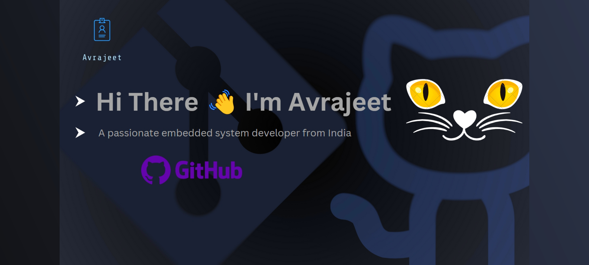

<h1 align="center">Avra's Hub</h1>

  

- 🌱 I’m currently learning **DBMS and DSA**

- 👨‍💻 All of my projects are available at [https://aghoshportfolio.dorik.io/](https://aghoshportfolio.dorik.io/)

- 💬 Ask me about **Arduino, Embedded system**

- 📫 How to reach me **avrajeet2003@gmail.com**

<h3 align="left">Connect with me:</h3>

<h3 align="left">Languages and Tools:</h3>

       

&nbsp;

